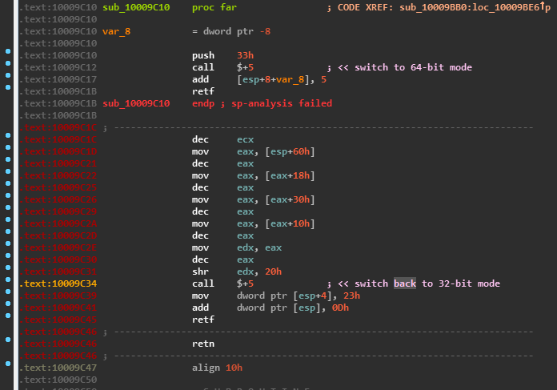
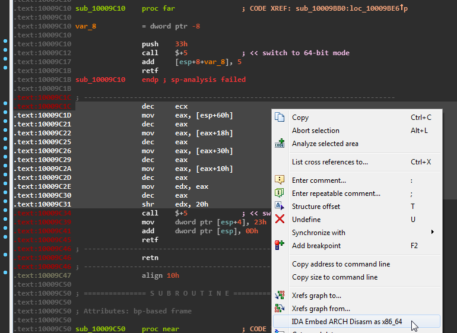

IDA Embed arch disasm
---------------------

Allows you to disassemble x86-64 code (like inlined WOW64 one) while you using 32-bit IDA database. This would be helpfull to analyze WOW64 mode switches.

## Dependencies

* `capstone` Python module

In case you use IDA 7 and newer make sure you download and install `capstone` for appropriate Python version and architecture, because since IDA 7 by default is 64-bit. You could find the binary installer [here](https://www.capstone-engine.org/download.html)

## Installation

* Install `capstone`

* Download the main plugin module [`ida-embed-arch-disasm.py`](https://github.com/a1ext/ida-embed-arch-disasm/raw/master/ida-embed-arch-disasm.py) (`Right click the link -> Save link as...`) and save it to IDA `plugins` folder

## Showcase

### Before

### Select the range you want to disassemble

### After (disassembled instructions are in comments)

